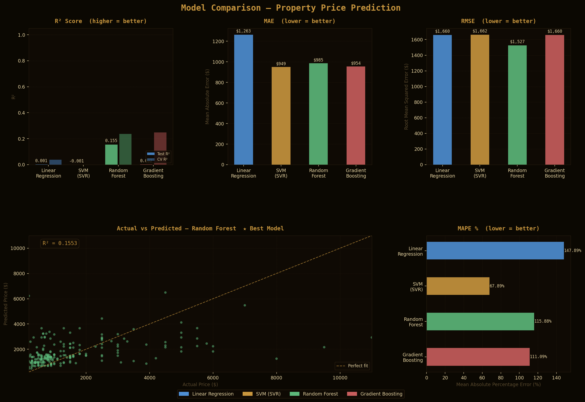

# 🏠 Cambodia House Rent Price Prediction

A full-stack machine learning application that predicts monthly house rental prices in Cambodia. Data is scraped from Cambodian real estate platforms, cleaned, analyzed, and fed into multiple regression models. A FastAPI backend serves predictions to a React frontend with an interactive map and analytics dashboard.

---

## 📌 Table of Contents

- [Project Overview](#project-overview)
- [Pipeline Phases](#pipeline-phases)
- [Project Structure](#project-structure)
- [Tech Stack](#tech-stack)
- [Getting Started](#getting-started)
- [API Reference](#api-reference)
- [ML Models](#ml-models)
- [Features](#features)
- [Screenshots](#screenshots)

---

## Project Overview

This project predicts monthly rental prices (in USD) for Cambodian properties across cities like Phnom Penh, Siem Reap, and Sihanoukville. The pipeline covers the full ML lifecycle — from raw web scraping to a deployable prediction API consumed by a React frontend.

**Target Variable**: `rent_price_usd` (monthly rental price in USD)  
**Data Source**: [Khmer24.com](https://www.khmer24.com) & [realestate.com.kh](https://realestate.com.kh)  
**Dataset Size**: ~1,106 property listings

---

## Pipeline Phases

### Phase 1 — 🕷️ Scraping

Raw listings are collected from Cambodian real estate platforms using two scraping strategies:

- **BeautifulSoup + Cloudscraper** (`data_collecting/scripts/scraper.py`) — for static HTML pages on Khmer24.com
- **Scrapy + Playwright** (`data_collecting/web-scraping/`) — for dynamic, JavaScript-rendered pages on realestate.com.kh

Fields collected per listing: `listing_id`, `city`, `district`, `location`, `property_type`, `rent_price_usd`, `posted_date`, `title`, `source_url`, `size_sqm`, `bedrooms`, `bathrooms`, `furnished`

```bash
# Run BeautifulSoup scraper
python data_collecting/scripts/scraper.py

# Run Scrapy spider
cd data_collecting/web-scraping
scrapy crawl house_rent
```

---

### Phase 2 — 🧹 Cleaning

Raw CSV data is cleaned and standardized in `data_cleaning/cleaning.py`:

- Removes duplicate listings
- Standardizes property type labels
- Extracts numeric values from mixed-format strings (e.g. `"$500/month"` → `500.0`)
- Handles outliers using IQR-based filtering
- Performs per-type median imputation for missing values
- Creates missing-value indicator flags (`size_sqm_was_missing`, etc.)

```bash
python data_cleaning/cleaning.py
```

**Output**: `Khmer24_cleaned_final.csv`

---

### Phase 3 — 📊 EDA (Exploratory Data Analysis)

Exploratory analysis is conducted in `notebooks/eda.ipynb` to understand:

- Price distributions by city, district, and property type
- Correlation between size, bedrooms, bathrooms, and rent price
- Missing value patterns and outlier distributions
- Geographic spread of listings

```bash
jupyter notebook notebooks/eda.ipynb
```

---

### Phase 4 — ⚙️ Feature Engineering

`ml/preprocess.py` transforms cleaned data into ML-ready features:

| Feature | Description |
|---|---|
| `log_size_sqm` | Log-transform of property size |
| `bath_per_bed` | Bathrooms-to-bedrooms ratio |
| `total_rooms` | Bedrooms + bathrooms |
| `furnished_score` | Binary flag (1 = furnished) |
| `district_freq` | Frequency encoding of district |
| `post_month` / `post_quarter` / `post_dayofweek` | Date-derived features |
| `type_*` | One-hot encoded property types (Flat, House, Villa, etc.) |
| `*_was_missing` | Missing value indicator flags |

**Artifacts saved**: `encoders.pkl`, `scaler.pkl`, `imputer.pkl`, `feature_names.pkl`

```bash
python ml/preprocess.py
```

**Output**: `Khmer24_features.csv`

---

### Phase 5 — 🤖 Training

Five regression models are trained in `ml/train_model.py`:

| Model | Key Hyperparameters |
|---|---|
| Linear Regression | Default |
| Ridge Regression | `alpha=10.0` |
| Random Forest | `n_estimators=300`, `max_depth=12`, `max_features="sqrt"` |
| SVR | `kernel="rbf"`, `C=200`, `epsilon=0.1` |
| Gradient Boosting | `n_estimators=400`, `learning_rate=0.05`, `max_depth=5`, `subsample=0.8` |

All models are evaluated with 5-fold cross-validation and the best model is saved as `best_model.pkl`.

```bash
python ml/train_model.py
```

---

### Phase 6 — 📈 Evaluation

`ml/evaluate_models.py` generates a visual comparison of all trained models:

- Bar charts for R², Cross-Validation R², MAE, RMSE, and MAPE
- Actual vs. Predicted scatter plot
- Saved to `ml/models/model_comparison.png`

```bash
python ml/evaluate_models.py
```

---

## Project Structure

```
Property-Price-Prediction/
├── backend/                        # FastAPI prediction server
│   ├── app/
│   │   ├── main.py                 # App entry point, CORS, routes
│   │   └── route/
│   │       └── predict.py          # POST /api/predict endpoint
│   ├── data/
│   │   └── properties.csv          # Property listings dataset
│   ├── requirements.txt
│   └── Makefile
├── data_cleaning/
│   └── cleaning.py                 # Data preprocessing & imputation
├── data_collecting/
│   ├── scripts/
│   │   ├── scraper.py              # BeautifulSoup scraper (Khmer24)
│   │   ├── config.py               # Column mappings & city config
│   │   └── debug_html.py           # HTML debugging utility
│   └── web-scraping/
│       └── khmer24/
│           └── spiders/
│               ├── house_rent.py   # Scrapy rental spider
│               └── realestate_kh.py # Playwright spider (realestate.com.kh)
├── frontend/                       # React + Vite SPA
│   ├── src/
│   │   ├── api/api.js              # Axios API client
│   │   ├── components/
│   │   │   ├── PredictionForm.jsx  # Input form with Leaflet map
│   │   │   ├── PriceResult.jsx     # Prediction results display
│   │   │   ├── ChartCard.jsx       # Reusable chart wrapper
│   │   │   └── Navbar.jsx
│   │   └── pages/
│   │       ├── Home.jsx            # Landing page
│   │       ├── Predict.jsx         # Prediction page
│   │       └── Dashboard.jsx       # Analytics dashboard
│   ├── package.json
│   └── vite.config.js
├── ml/
│   ├── preprocess.py               # Feature engineering pipeline
│   ├── train_model.py              # Model training & selection
│   ├── evaluate_models.py          # Visualization & metrics
│   ├── predict.py                  # Inference logic (used by backend)
│   └── models/
│       └── model_comparison.png    # Evaluation chart
└── notebooks/
    ├── eda.ipynb                   # Exploratory Data Analysis
    └── visualization.ipynb         # Visualization notebook
```

---

## Tech Stack

### Backend
| Technology | Version | Purpose |
|---|---|---|
| Python | 3.x | Core language |
| FastAPI | 0.135.2 | REST API framework |
| Uvicorn | 0.42.0 | ASGI server |
| scikit-learn | 1.8.0 | ML models & preprocessing |
| Pandas | 3.0.1 | Data manipulation |
| NumPy | 2.4.3 | Numerical computing |
| Pydantic | 2.12.5 | Request/response validation |

### Frontend
| Technology | Version | Purpose |
|---|---|---|
| React | 19.2.4 | UI framework |
| Vite | 8.0.1 | Build tool & dev server |
| Tailwind CSS | 4.2.2 | Utility-first styling |
| Axios | 1.14.0 | HTTP client |
| React Router DOM | 7.13.2 | Client-side routing |
| Recharts | 3.8.1 | Charts & graphs |
| Leaflet | 1.9.4 | Interactive maps |

### Data Collection
| Technology | Purpose |
|---|---|
| BeautifulSoup | HTML parsing |
| Cloudscraper | Bypass anti-bot measures |
| Scrapy | Scalable web crawling |
| Playwright | Dynamic page rendering |

---

## Getting Started

### Prerequisites

- Python 3.9+
- Node.js 18+
- npm or yarn

### Backend Setup

```bash
cd backend

# Install Python dependencies (using pip)
pip install -r requirements.txt

# Run development server (port 8001)
make run-dev

# Run production server (port 8000)
make run-prod
```

The API will be available at `http://localhost:8001`.

### Frontend Setup

```bash
cd frontend

# Install dependencies
npm install

# Start development server (port 5173)
npm run dev

# Build for production
npm run build
```

The app will be available at `http://localhost:5173`.

### Running the Full ML Pipeline

```bash
# 1. Scrape data
python data_collecting/scripts/scraper.py

# 2. Clean data
python data_cleaning/cleaning.py

# 3. Engineer features & preprocess
python ml/preprocess.py

# 4. Train models
python ml/train_model.py

# 5. Evaluate and visualize results
python ml/evaluate_models.py
```

---

## API Reference

### `GET /`
Health check endpoint.

**Response**
```json
{ "message": "Cambodia House Rent Price Prediction API" }
```

---

### `POST /api/predict`
Predict monthly rental price for a property.

**Request Body**
```json
{
  "size_sqm": 80,
  "bedrooms": 2,
  "bathrooms": 1,
  "property_type": "Flat",
  "furnishing": "furnished"
}
```

| Field | Type | Description |
|---|---|---|
| `size_sqm` | `float` | Property size in square meters |
| `bedrooms` | `int` | Number of bedrooms |
| `bathrooms` | `int` | Number of bathrooms |
| `property_type` | `string` | One of: `Flat`, `House`, `Villa`, `Twin Villa`, `Link House`, `Room`, `Shop`, `Shophouse` |
| `furnishing` | `string` | One of: `furnished`, `unfurnished`, `unknown` |

**Response**
```json
{
  "predicted_price": 650.0,
  "price_range_low": 585.0,
  "price_range_high": 715.0,
  "model_used": "Random Forest",
  "confidence_note": "Estimate based on similar listings"
}
```

---

### `GET /api/predict/health`
Check model loading status.

---

## ML Models

All five models are trained on an 80/20 train-test split and evaluated with the following metrics:

| Metric | Description |
|---|---|
| **MAE** | Mean Absolute Error (USD) |
| **RMSE** | Root Mean Squared Error (USD) |
| **R²** | Coefficient of Determination |
| **MAPE** | Mean Absolute Percentage Error |
| **CV R²** | 5-Fold Cross-Validation R² |

The best-performing model is automatically saved as `ml/models/best_model.pkl` and loaded by the prediction API.



---

## Features

- 🏡 **Property Price Prediction** — Input property details and get an instant monthly rent estimate with a ±10% confidence range
- 🗺️ **Interactive Map** — Select location on a Leaflet map with reverse geocoding via OpenStreetMap Nominatim
- 📊 **Analytics Dashboard** — Visualize market trends, price distributions, and feature importances using Recharts
- 🤖 **Multi-Model Training** — Trains and compares 5 regression models; best model is auto-selected
- 🔄 **End-to-End Pipeline** — Reproducible data flow from web scraping to deployed API
- ⚡ **Fast API** — Sub-100ms prediction responses via FastAPI + Uvicorn

---

## License

This project is for educational and research purposes.
